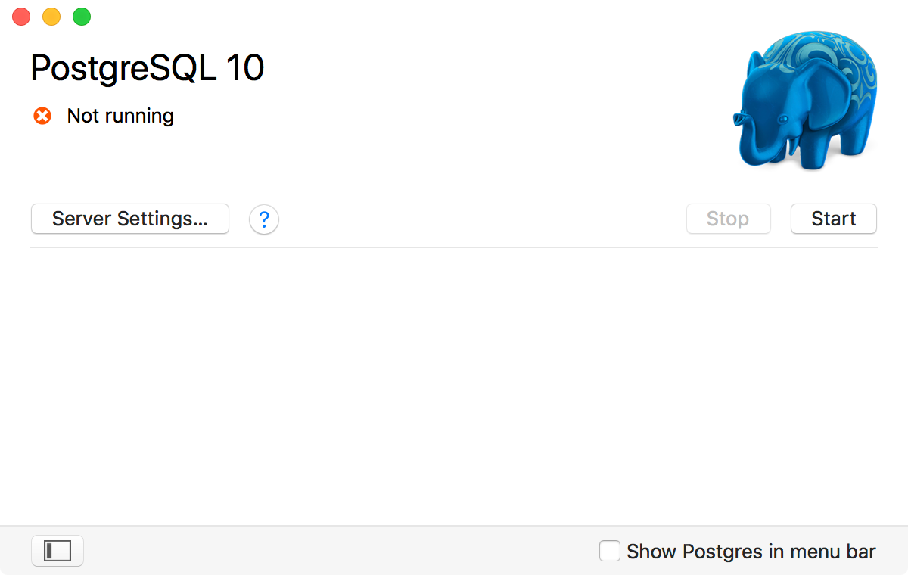
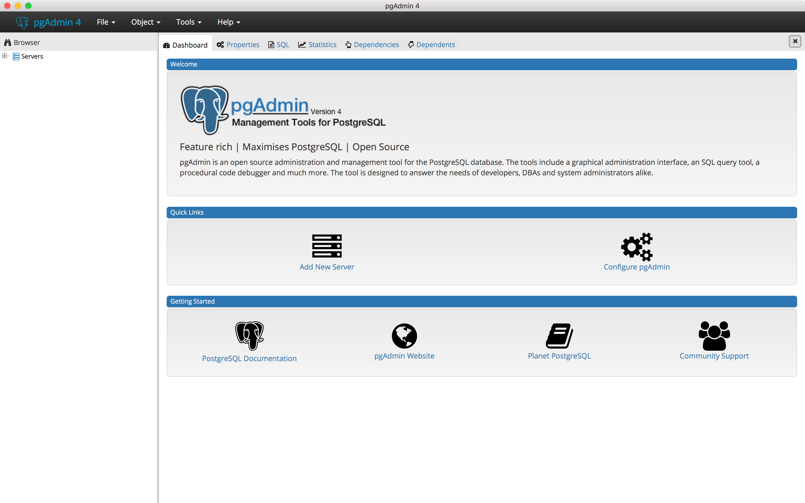
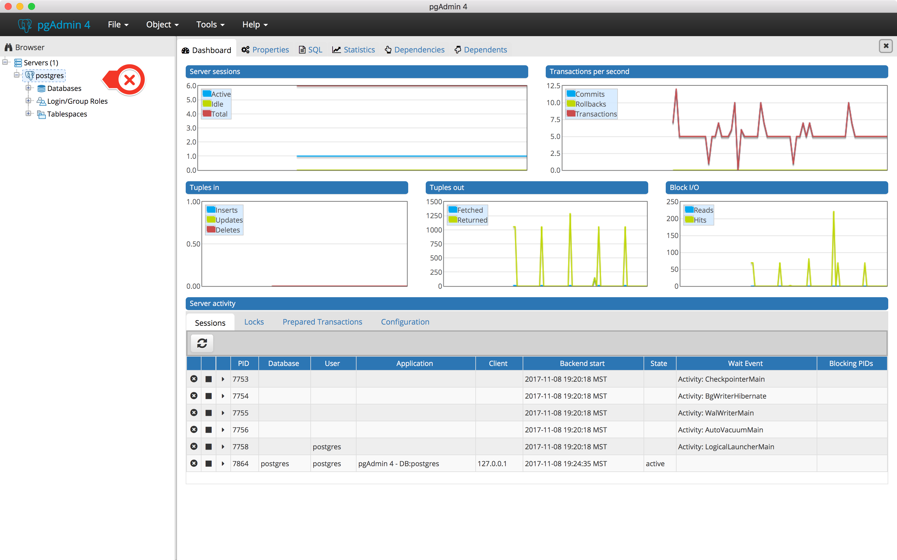
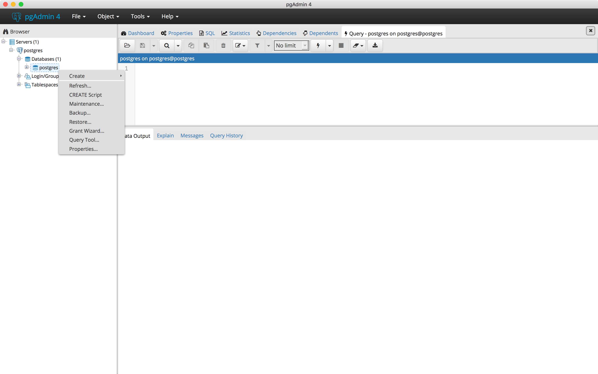
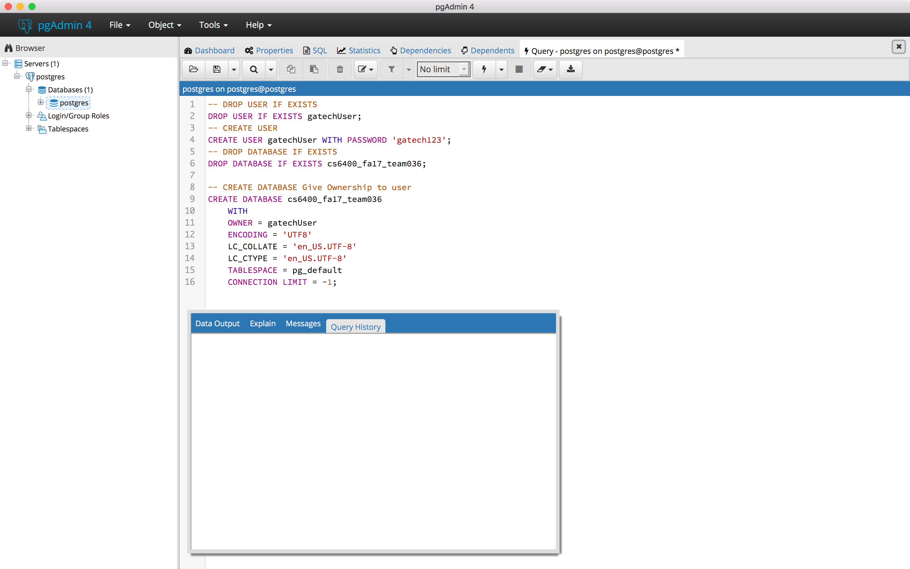
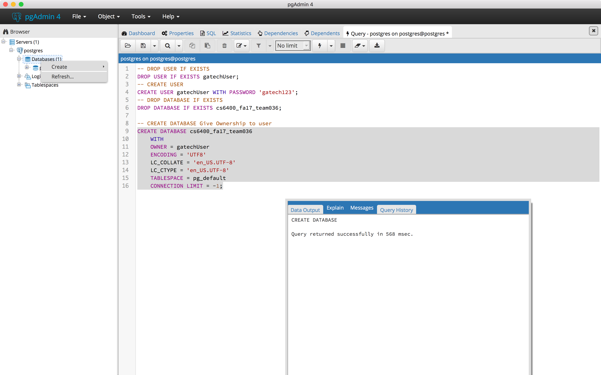
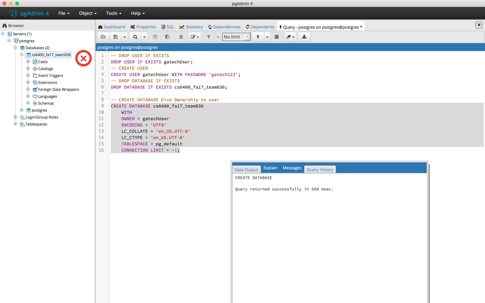
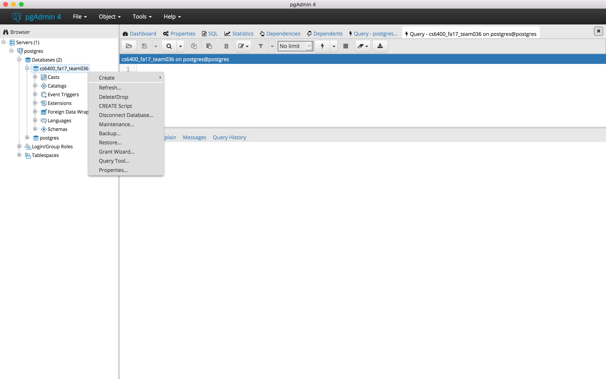
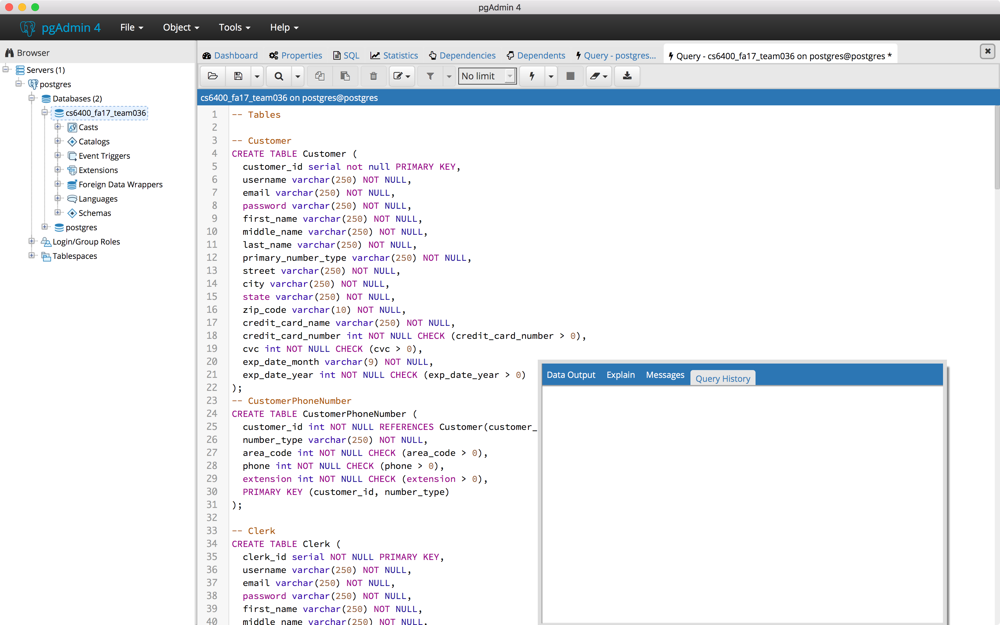

# Getting started with this Repository


### Steps 

Before doing anything with this code, you need to install a few prereqs. 

### Install Postgresql 

**MacOSX**: download [Postgres.app](Postgres.app) and also [PGAdmin](https://www.pgadmin.org)

**Windows**: Download [Postgres](https://www.postgresql.org/download/windows/) and then [PGAdmin](https://www.pgadmin.org)


Follow the directions of your Postgres install and then Open PGAdmin and connect to your Postgesql server


 ### Create users and tables for Postgresql
 
For Windows launch Postgres. 

For Map open Postgres App



Click start and then open PGAdmin



Select your server and click connect (No password needed)

 

 Right click on the Postgres database and select the query tool option.

 


 
 Open the file found in ```phase2/team036_p2_schema.sql``` run the first four commands one at a time. 

 

 Refresh your database list

 

 Choose the newly created database

 

 Select query tool

 

 Run the remaning queries (Tables) all at once.

 

 That's It
 
 
 
 ### Install Node.js
 
 
 Simply follow the installation for your operation system, [here](https://nodejs.org/en/download/)
 
 
 ### Working with the code
 
 If you've done everything else, download the repository locally.
 
 Go to the phase3 folder 
 
 ```npm install```
 
 Once complete
 
 ```node index.js```
 
 
 
 This should run the web server.
 
 Open a browser and go to ```localhost:3000```
 
 You should get a message in your terminal that looks like this
 
 ```null Result {
      command: 'SELECT',
      rowCount: 1,
      oid: null,
      rows: [ anonymous { now: 2017-11-08T01:18:43.096Z } ],
      fields: 
       [ Field {
           name: 'now',
           tableID: 0,
           columnID: 0,
           dataTypeID: 1184,
           dataTypeSize: 8,
           dataTypeModifier: -1,
           format: 'text' } ],
      _parsers: [ [Function: parseDate] ],
      RowCtor: [Function: anonymous],
      rowAsArray: false,
      _getTypeParser: [Function: bound ] }
```
 
Now you are connected to Postgresql and your Node.js server is running. 